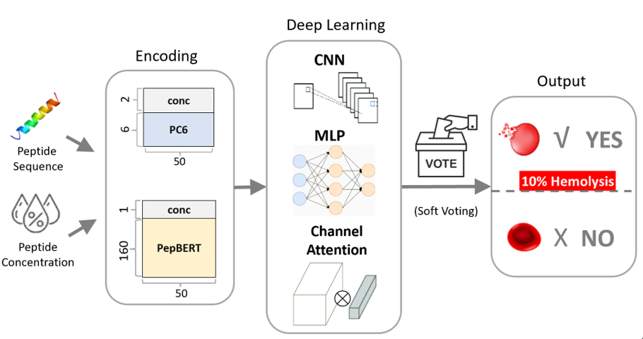

# LysisPeptica
A Docker container for therapeutic peptide hemolysis risk prediction. The pipeline includes a selectable hemolysis-percentage threshold for prediction (5, 10, 20, or 30%), with 10% set as the default.

### Main Goal
Therapeutic Peptides or Antimicrobial peptides (AMPs) with high hemolysis risk are unsuitable as drugs, but experimental validation is costly. Our model enables early in silico screening to filter out hemolytic candidates.

<p align="center">
  
</p>

Our web-based AI predictor, LysisPeptica is accessible at https://axp.iis.sinica.edu.tw/hemolysis/

---

### Step by step to deploy this docker

1. Download this repository to your local machine.

2. Navigate to the project directory:

```bash
cd LysisPeptica
```


3. Build the docker image:

```bash
docker build -t lysispeptica .
```

(wait for some minutes)

4. Test input and output:

```bash
docker run --rm \
  -v /your_path/your.fa:/app/data/input.fasta \
  -v /your_output_folder:/app/output \
  lysispeptica --thr_id [hemolysis%]
```


* replace "/your_path/your.fa" with your input FASTA file path.
* replace "/your_output_folder" with the directory where output CSV files should be written.
* [hemolysis%] wil be 5,10,20,30. Default is 10.

---
### Input fasta format

```
>seq0|Conc=21.5
QAFQTFKPDWNKIRYDAMKMQTSLGQMKKRFNL
>seq1|Conc=14.3
WRPGRWWRPGRWWRPGFGGGRGGPGRW
```

* concentration unit is ug/ml
* "|Conc=" can't be removed
* If concentration is empty (>seq0|Conc=  ), or isn't a number (>seq0|Conc=?ABC!), 
the system will asign default value, 50 ug/ml.
* If input peptide is longer than 49, system will raise error. We validated input fasta format outside the docker in our werbsite design.
But I also design sliding window method for handling peptides with length > 49. User can manually modify code as below in predictor.py to activate sliding window method.

Initial:
```python
#read input fasta
#idli, seqli, ugmlli = read_fasta_slice(input_fasta, 25, 50)
idli, seqli, ugmlli = read_fasta(input_fasta, 50)
```

Active sliding window, 25 is default sliding range
```python
#read input fasta
idli, seqli, ugmlli = read_fasta_slice(input_fasta, 25, 50)
#idli, seqli, ugmlli = read_fasta(input_fasta, 50)
```

---

### Encoding
LysisPeptica utilized PC6 (https://github.com/LinTzuTang/PC6-protein-encoding-method) and PepBERT (https://github.com/dzjxzyd/PepBERT)

---