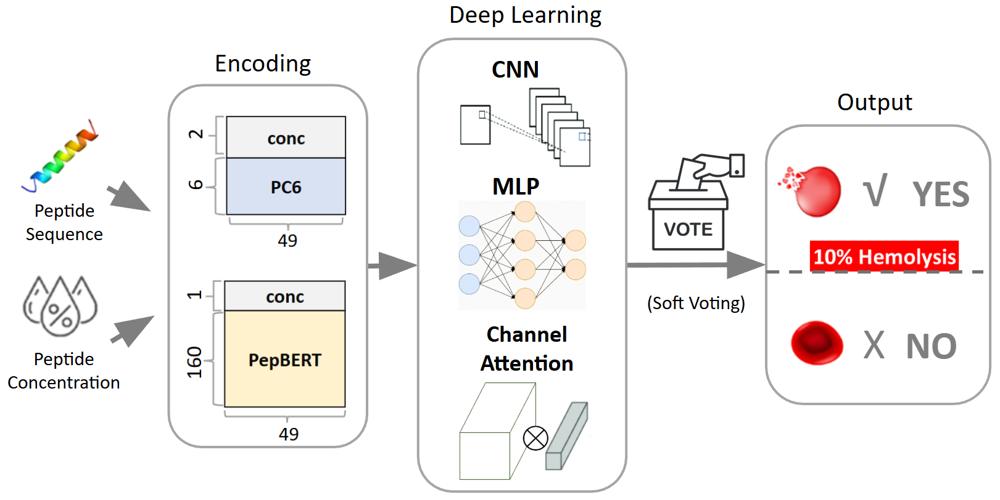

# LysisPeptica
A Docker container for therapeutic peptide hemolysis risk prediction. The pipeline includes a selectable hemolysis-percentage threshold for prediction (5, 10, 20, or 30%), with 10% set as the default.

### Main Goal
Therapeutic Peptides or Antimicrobial peptides (AMPs) with high hemolysis risk are unsuitable as drugs, but experimental validation is costly. Our model enables early in silico screening to filter out hemolytic candidates.

<p align="center">
  
</p>

Our web-based AI predictor, LysisPeptica is accessible at https://axp.iis.sinica.edu.tw/hemolysis/

---

### Step by step to deploy this docker

1. Download this repository to your local machine.

2. Navigate to the project directory:

```bash
cd LysisPeptica
```


3. Build the docker image:

```bash
docker build -t lysispeptica .
```

(wait for some minutes)

4. Check docker image existence

```bash
docker images
```

(size of the Docker image layers might be 12.7GB)


5. Test input and output:

```bash
docker run --rm \
  -v /your_path/your.fa:/app/data/input.fasta \
  -v /your_output_folder:/app/output \
  lysispeptica --thr_id [hemolysis%]
```


* replace "/your_path/your.fa" with your input FASTA file path.
* replace "/your_output_folder" with the directory where output CSV files should be written.
* [hemolysis%] wil be 5,10,20,30. Default is 10.
* example:

```bash
docker run --rm \
  -v /home/eric/test.fa:/app/data/input.fasta \
  -v /home/eric:/app/output \
  lysispeptica --thr_id 10
```


LysisPeptica were developed  on Linux Ubuntu 22.04.5, Python 3.10.16.  
A simplified environment.yml will be provided in the future.

---
### Input fasta format

```
>seq0|Conc=21.5
QAFQTFKPDWNKIRYDAMKMQTSLGQMKKRFNL
>seq1|Conc=14.3
WRPGRWWRPGRWWRPGFGGGRGGPGRW
```

* concentration unit is µg/mL.
* The > prefix and |Conc= field must remain unchanged.
* If the concentration field is empty (e.g., >seq0|Conc=) or contains a non-numeric value (e.g., >seq0|Conc=?ABC!), the system automatically assigns the default concentration of 50 µg/mL.
* Peptides longer than 49 amino acids will trigger an error. Length validation is already enforced on our website before Docker forwarding.
* A sliding-window method for peptides longer than 49 aa is also implemented but disabled by default. Users may enable it manually by modifying predictor.py as below.

Initial
```python
#read input fasta
#idli, seqli, ugmlli = read_fasta_slice(input_fasta, 25, 50)
idli, seqli, ugmlli = read_fasta(input_fasta, 50)
```

Active sliding-window, 25 is default sliding range
```python
#read input fasta
idli, seqli, ugmlli = read_fasta_slice(input_fasta, 25, 50)
#idli, seqli, ugmlli = read_fasta(input_fasta, 50)
```

---

### Details
LysisPeptica utilized 2 encoding methods,
PC6 (https://github.com/LinTzuTang/PC6-protein-encoding-method) and PepBERT (https://github.com/dzjxzyd/PepBERT)

The required model files and weights from PepBERT's Hugging Face have been included in this repository.
The Docker image is fully standalone and does not require any external downloads during runtime.

---